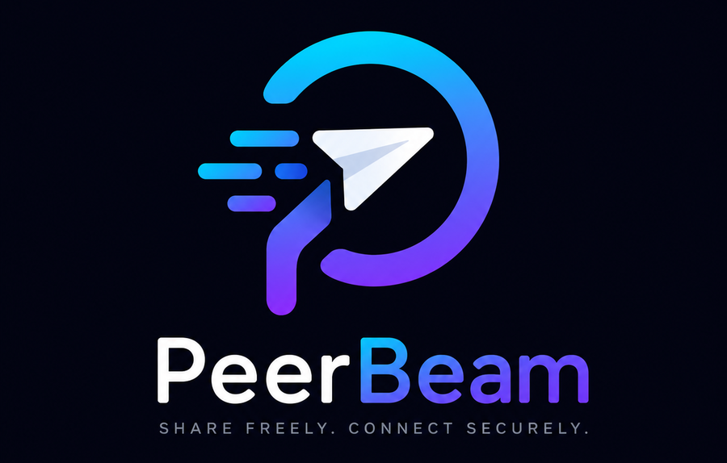

<div align="center">



# PeerBeam

**Zero-configuration, secure, cross-platform file & clipboard sharing.**

Open the app → see nearby devices → click → send. No IP addresses, no pairing
codes, no accounts, no cloud.

</div>

---

PeerBeam is a modern take on LAN file sharing. It discovers peers across LAN,
mDNS, and Tailscale at once, merges them into one device list, and streams files
of any size with end-to-end encryption and resumable, integrity-checked
transfers. A Rust engine does the work; a Flutter app and a first-class CLI are
two frontends over the same core.

> **Status: 🟢 Release Candidate.** Engine, discovery, security, QUIC transport,
> RouteManager, full FFI, Dart SDK, and the Flutter app are implemented and
> tested (204 Rust + 35 Flutter tests, clippy/fmt clean). Networked
> `send`/`receive` work end to end over QUIC with mutual authentication —
> **verified live on real hardware** (Android → Linux, byte-exact). Linux + CLI
> are build- and run-verified; Android runs the full engine on-device.
> **Stable v1.0 is gated on Windows/macOS host builds and a real multi-transport
> matrix** (this project's audit ran on a single Linux host). Remaining gaps:
> `clipboard`/`history` CLI, desktop OS notifications/tray, persistent device
> identity. See [Stable Readiness](docs/STABLE_READINESS.md),
> [Known Issues](docs/KNOWN_ISSUES.md), and the docs below.

## Highlights

- **Zero config** — no addresses or codes; discovery is automatic and merged
  across providers.
- **Works where LAN doesn't** — Tailscale support (CLI + LocalAPI, MagicDNS)
  for VPN / headless / cross-network reach.
- **Streaming everything** — unlimited file size, chunked, never loads a whole
  file into RAM; folders keep their structure.
- **Resumable & verified** — receiver-reported offsets, whole-file SHA-256,
  automatic retry, atomic safe writes.
- **Secure by default** — X25519 + AES-256-GCM, mutual authentication, TOFU
  trust pinning, per-frame replay protection.
- **Two frontends, one core** — polished Material 3 Flutter app and a
  scriptable, SSH-friendly CLI.
- **Private** — no accounts, no telemetry, no cloud dependency.

## Repository layout

```
rust/       Rust workspace — engine, providers, CLI (the core)
flutter/    Flutter app — desktop (Win/macOS/Linux) + Android
docs/       Component and top-level documentation
```

The Rust workspace follows Clean Architecture: dependencies point inward toward
`peerbeam-domain`, which defines the *ports* (traits) every provider implements.
See [Architecture](docs/ARCHITECTURE.md).

## Quick start

### Build the CLI

```bash
cd rust
cargo build --release -p peerbeam-cli
./target/release/peerbeam --help
```

### Try it

```bash
peerbeam doctor            # check the environment
peerbeam discover          # find nearby devices
peerbeam benchmark loopback --size 512
```

Transfer a file between two machines (real, over QUIC):

```bash
# on the receiver
peerbeam receive
# on the sender (same LAN / tailnet)
peerbeam send movie.mkv --to "<receiver name>"    # or: --addr <ip>:49600
```

Full command reference: [CLI](docs/CLI.md). (`clipboard`/`history` and
`daemon stop|status` remain gated — see the CLI doc.)

### Run the app

```bash
cd flutter
flutter run              # desktop, or an attached Android device
```

## Documentation

| Topic | Doc |
|---|---|
| Getting started as a contributor | [Developer Guide](docs/DEVELOPER_GUIDE.md) · [Contributing](CONTRIBUTING.md) |
| System design, crates, ports, data flow | [Architecture](docs/ARCHITECTURE.md) |
| Discovery, route selection, link layer | [Networking](docs/NETWORKING.md) · [Discovery](docs/DISCOVERY.md) |
| Transfer engine (stream / folder / resume) | [Transfer](docs/TRANSFER.md) |
| On-the-wire transfer protocol | [Transfer Protocol](docs/TRANSFER_PROTOCOL.md) |
| Runnable & copy-paste examples | [examples/](examples/README.md) |
| Clipboard sharing | [Clipboard](docs/CLIPBOARD.md) |
| Encryption, auth, trust, safe writes | [Security](docs/SECURITY.md) |
| Embedding the Rust engine | [API](docs/API.md) |
| Flutter ⇄ Rust FFI bridge | [FFI](docs/FFI.md) |
| Command-line interface | [CLI](docs/CLI.md) |
| Flutter UI | [UI](docs/UI.md) |
| Desktop support & compatibility | [Desktop](docs/DESKTOP.md) |
| Android platform integration | [Android](docs/ANDROID.md) |
| Devices & merge/dedup | [Devices](docs/DEVICES.md) |
| Test strategy | [Testing](docs/TESTING.md) |
| Real-network integration tests | [Network Testing](docs/NETWORK_TESTING.md) |
| Performance baselines | [Benchmarks](docs/BENCHMARKS.md) |
| Common problems | [Troubleshooting](docs/TROUBLESHOOTING.md) |
| v1 → v2 changes | [Migration](docs/MIGRATION.md) |
| Install / build / release | [Install](docs/INSTALL.md) · [Build](docs/BUILD.md) · [Release](docs/RELEASE.md) |
| Release readiness & reports | [Beta Readiness](docs/BETA_READINESS.md) · [Compatibility](docs/COMPATIBILITY_MATRIX.md) · [Performance](docs/PERFORMANCE_REPORT.md) · [Security Report](docs/SECURITY_REPORT.md) · [Known Issues](docs/KNOWN_ISSUES.md) |
| Project quality & OSS readiness | [Doc Audit](docs/DOCUMENTATION_AUDIT.md) · [API Review](docs/API_REVIEW.md) · [OSS Readiness](docs/OPEN_SOURCE_READINESS.md) · [Contributor Experience](docs/CONTRIBUTOR_EXPERIENCE.md) |
| Release gate (v1.0 audit) | [Stable Readiness](docs/STABLE_READINESS.md) · [Final Audit](docs/FINAL_AUDIT.md) · [Security](docs/FINAL_SECURITY_REVIEW.md) · [Performance](docs/FINAL_PERFORMANCE_REVIEW.md) · [Compatibility](docs/FINAL_COMPATIBILITY_MATRIX.md) · [Release Notes](docs/RELEASE_NOTES_v1.0.md) · [Roadmap](docs/LONG_TERM_ROADMAP.md) |
| UX & design | [UX Audit](docs/UX_AUDIT.md) · [Design Decisions](docs/DESIGN_DECISIONS.md) · [UX Notes](docs/UX_NOTES.md) · [UI Limitations](docs/KNOWN_UI_LIMITATIONS.md) |
| How to contribute | [Contributing](CONTRIBUTING.md) |

## Development

```bash
cd rust
cargo test --workspace              # full test suite
cargo clippy --workspace --all-targets -- -D warnings
cargo fmt --all

cd ../flutter
flutter test
```

## License

AGPL-3.0-or-later — full text in [LICENSE](LICENSE). See
[Contributing](CONTRIBUTING.md) for the contribution flow.
