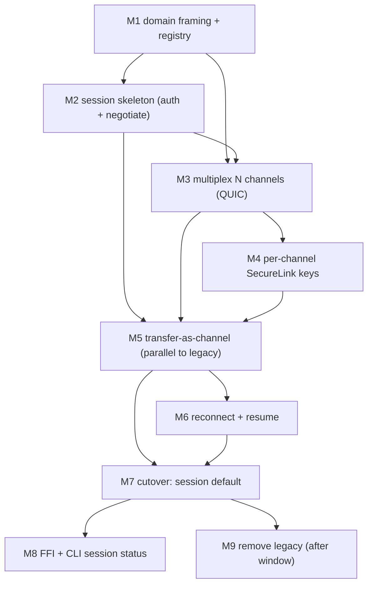

# PeerSession Dependency Graph (Phase A2)

> **Status: DERIVED planning document.** Conforms to the constitutional set;
> **planning only — no production code modified.** Companion to
> [MILESTONES](PEERSESSION_MILESTONES.md).

The dependency-safe implementation order. Every node compiles and passes the gate on
its own; an edge means "must land first." This proves the milestone order is a valid
topological sort with no cycles (each milestone leaves the repo working).

---

## 1. Milestone dependency DAG



**Critical path:** M1 → M2 → M3 → M4 → M5 → M6 → M7. M8 and M9 hang off M7.

## 2. Why each edge exists

| Edge | Reason |
|---|---|
| M1 → M2 | the session skeleton frames `SessionHello` using M1's frame/registry types |
| M1 → M3 | multiplexed channels carry M1 session frames |
| M2 → M3 | channels are opened *by* the session's control plane |
| M2/M3 → M4 | per-channel keys need both the session (master keys) and channels to key |
| M2/M3/M4 → M5 | transfer-as-channel needs a session, channels, and per-channel sealing |
| M5 → M6 | reconnect/resume operates on the channelized transfer |
| M5,M6 → M7 | cutover requires parity (M5) **and** reconnect/resume (M6) proven |
| M7 → M8 | FFI/CLI expose the now-default session state |
| M7 → M9 | legacy is only removable once session is the default (+ support window) |

## 3. Crate dependency impact (build order)

PeerSession respects the existing inward-pointing layering
([ARCHITECTURE.md](ARCHITECTURE.md)); new work is added at the same layers, so the
crate build graph is unchanged in shape.

```
peerbeam-domain            (M1: + Session/MessageChannel/MessageHandler ports, frame types)
      ▲
      ├── peerbeam-transfer         (M2 session.rs · M4 secure.rs keys · M5 handler · M6 recover)
      ├── peerbeam-transfer-quic    (M3 N bi-streams)
      ▲
peerbeam-engine            (M5 dispatch/registry · M7 default wiring)
      ▲
peerbeam-ffi               (M8 pb_* session status)      bins/peerbeam-cli (M8 status detail)
      ▲
Flutter                    (Phase B only — consumes new events additively)
```

- **No new inter-crate dependency direction** is introduced; adapters still depend only
  on `peerbeam-domain` (I1). New ports live in the domain and are implemented outward.
- **No crate is split or merged.** `PeerSession` lives in `peerbeam-transfer` (beside
  `SecureLink`/`authenticate`, which it reuses), not a new crate — smallest change
  (DR2). A dedicated `peerbeam-session` crate is an option only if `peerbeam-transfer`
  grows unwieldy (I8), decided during M2, not presupposed.

## 4. Parallelizable vs serial

- **Serial (critical path):** M1 → M2 → M3 → M4 → M5 → M6 → M7.
- **Can overlap once their deps land:** M3 and M4 are close but M4 needs M3 (channels
  must exist to key them), so they are near-serial; documentation, the fault-injection
  test harness, and the fuzz target ([TEST_PLAN](PEERSESSION_TEST_PLAN.md §5)) can be
  built in parallel with any milestone since they are test-only.
- **Independent of the whole line:** unrelated bug-fixes and Phase-B groundwork proceed
  on `main` throughout (flags keep the session path off until M7).

## 5. Cycle check

The DAG above has no back-edges: each milestone depends only on earlier ones, and each
leaves the repository green (MILESTONES ground rules). Therefore the order is a valid,
cycle-free topological sort — a milestone never requires a not-yet-built dependency, so
there are no broken intermediate commits.
