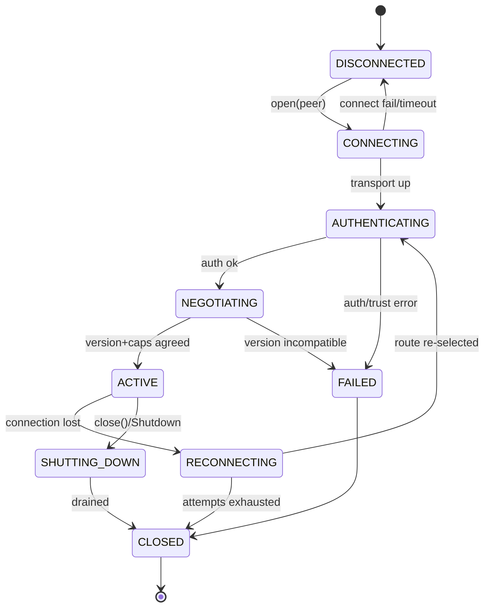
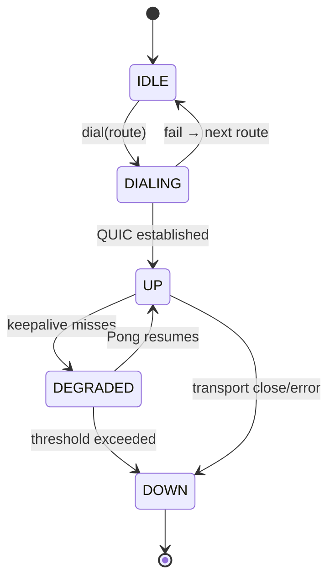
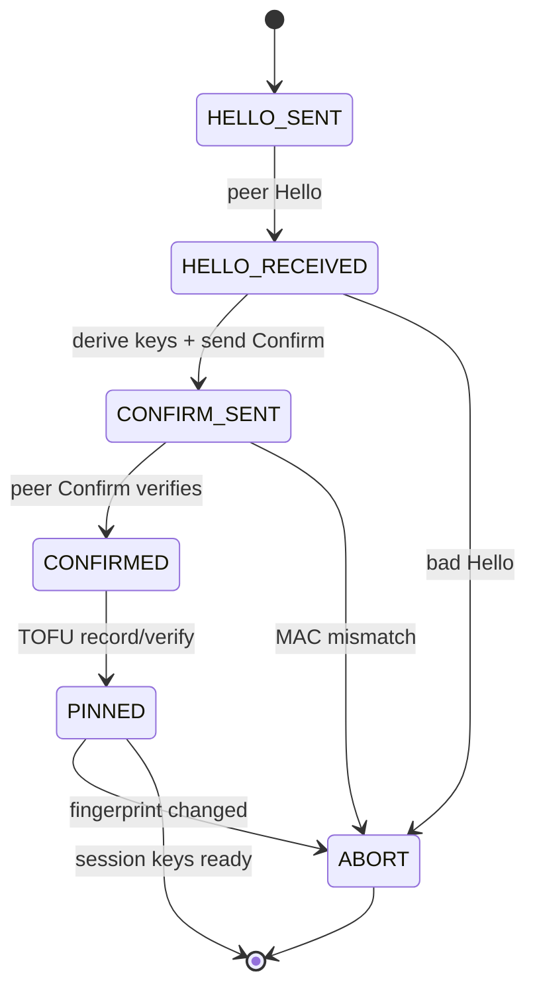
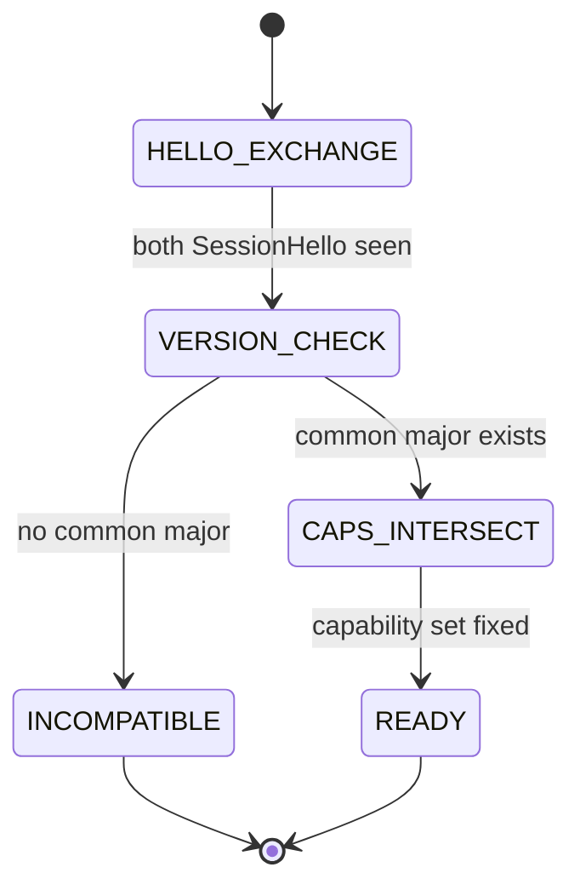
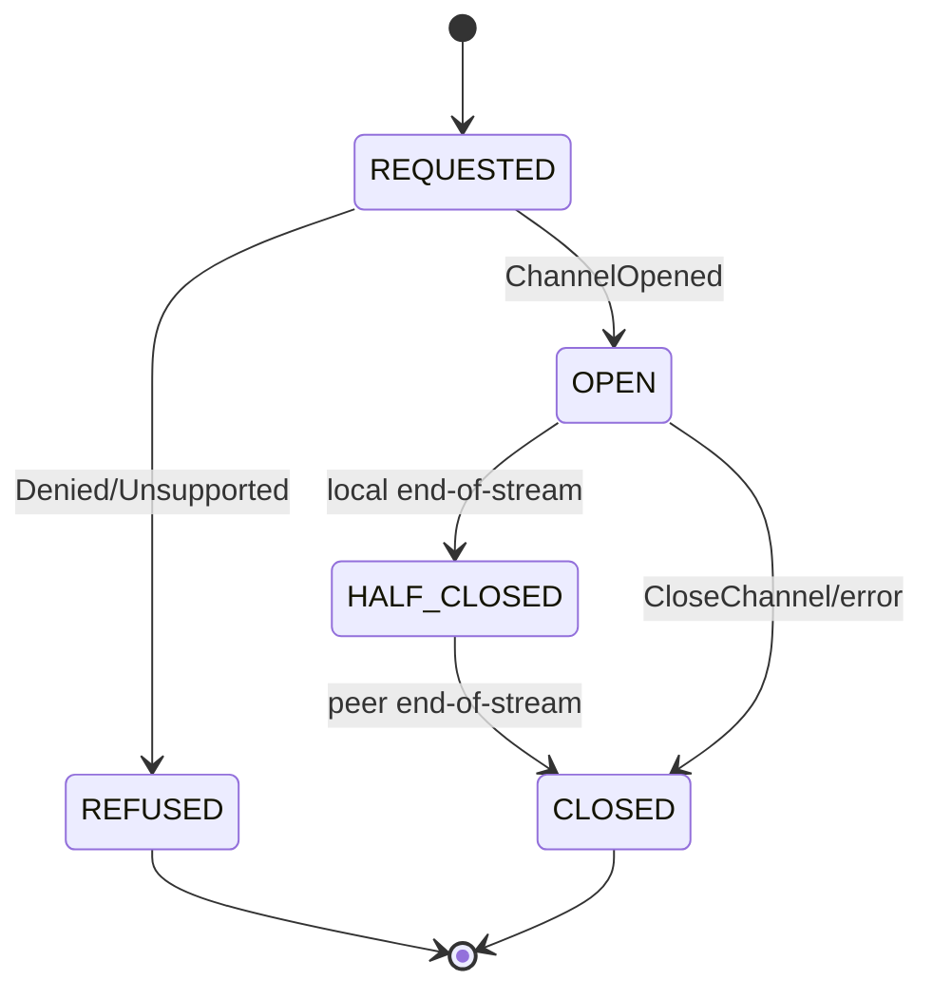
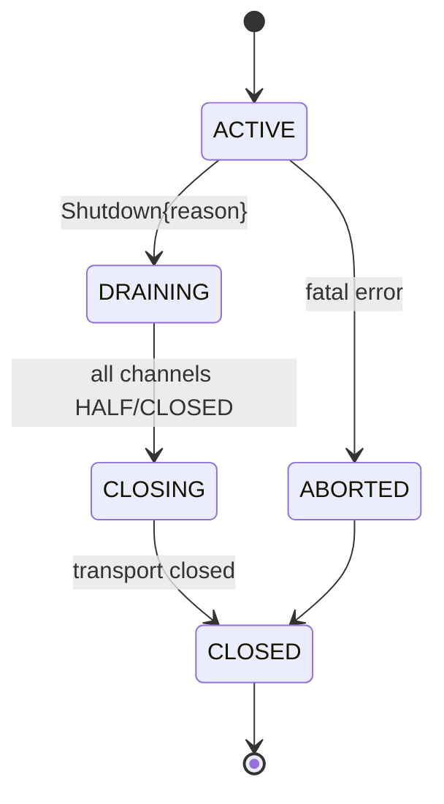
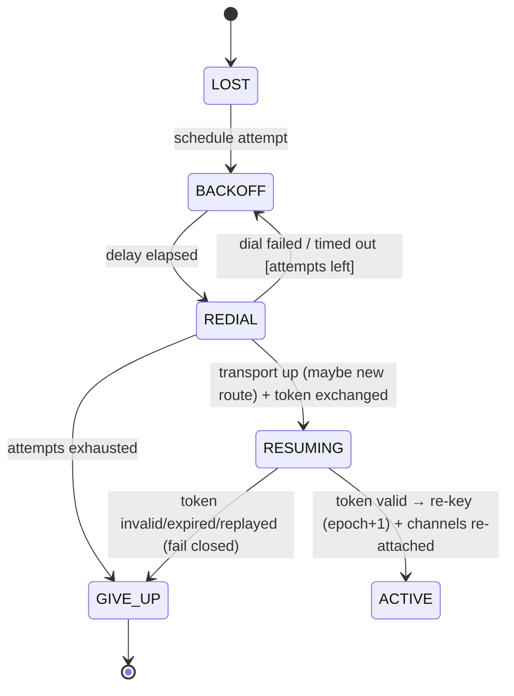

# PeerSession State Machines

> **Status: DERIVED specification** (stability-critical). Conforms to the
> constitutional documents; **specification only — no production code**. Companion to
> [PEERSESSION_SPEC.md](PEERSESSION_SPEC.md).

Seven machines define PeerSession's dynamic behavior. Each is given as a diagram plus
a transition table (the table is authoritative where a viewer does not render the
diagram). Guards are in `[brackets]`; actions in *italics*.

---

## 1. PeerSession (top level)

| State | Event | Next | Action / guard |
|---|---|---|---|
| DISCONNECTED | `open(peer)` | CONNECTING | RouteManager selects route |
| CONNECTING | transport up | AUTHENTICATING | open control channel |
| CONNECTING | fail/timeout | DISCONNECTED | typed transport error |
| AUTHENTICATING | auth ok | NEGOTIATING | session keys derived |
| AUTHENTICATING | auth/trust error | FAILED | **fatal**, no retry (I6) |
| NEGOTIATING | caps agreed | ACTIVE | SessionId bound; channels allowed |
| NEGOTIATING | incompatible major | FAILED | `VersionIncompatible` |
| ACTIVE | connection lost | RECONNECTING | preserve SessionId + resume token |
| ACTIVE | `close()` / `Shutdown` | SHUTTING_DOWN | stop new opens |
| RECONNECTING | route re-selected | AUTHENTICATING | re-auth + re-negotiate |
| RECONNECTING | attempts exhausted | CLOSED | give up (bounded backoff) |
| SHUTTING_DOWN | drained | CLOSED | channels closed, resources freed |
| FAILED | — | CLOSED | surface error |

## 2. Connection lifecycle (transport)

| State | Event | Next | Action |
|---|---|---|---|
| IDLE | `dial(route)` | DIALING | RouteManager gives the route |
| DIALING | QUIC up | UP | hand transport to session |
| DIALING | fail | IDLE | try next-priority route |
| UP | keepalive miss | DEGRADED | start liveness countdown |
| DEGRADED | `Pong` | UP | reset countdown |
| DEGRADED | threshold | DOWN | declare dead → session RECONNECTING |
| UP | close/error | DOWN | notify session |

## 3. Authentication

| State | Event | Next | Action / guard |
|---|---|---|---|
| HELLO_SENT | peer Hello | HELLO_RECEIVED | capture pubkey/nonce/id/name |
| HELLO_RECEIVED | — | CONFIRM_SENT | ECDH; build transcript; send Confirm |
| CONFIRM_SENT | peer Confirm | CONFIRMED | *verify HMAC with recv key* |
| CONFIRM_SENT | MAC mismatch | ABORT | key-confirmation failure (fatal) |
| CONFIRMED | — | PINNED | TrustStore lookup/record |
| PINNED | `[fingerprint unchanged]` | done | derive session keys |
| PINNED | `[fingerprint changed]` | ABORT | possible MITM → reject (I6) |

## 4. Capability negotiation

| State | Event | Next | Action / guard |
|---|---|---|---|
| HELLO_EXCHANGE | both `SessionHello` | VERSION_CHECK | compare versions |
| VERSION_CHECK | `[common major]` | CAPS_INTERSECT | pick highest common minor |
| VERSION_CHECK | `[none]` | INCOMPATIBLE | `VersionIncompatible` → FAILED |
| CAPS_INTERSECT | — | READY | agreed = supported(A) ∩ supported(B); flags merged |
| READY | — | done | only agreed channel types may open |

## 5. Channel lifecycle (per channel; part of "session shutdown" scope)

| State | Event | Next | Action / guard |
|---|---|---|---|
| REQUESTED | `ChannelOpened` | OPEN | derive per-channel keys |
| REQUESTED | `Denied`/`Unsupported` | REFUSED | `[trust/consent fail]` or unknown type |
| OPEN | local EOS | HALF_CLOSED | stop sending; keep receiving |
| HALF_CLOSED | peer EOS | CLOSED | flush + free |
| OPEN | `CloseChannel`/error | CLOSED | scope failure to this channel |

## 6. Session shutdown

| State | Event | Next | Action |
|---|---|---|---|
| ACTIVE | `Shutdown{reason}` | DRAINING | refuse new opens; let channels finish |
| DRAINING | channels drained | CLOSING | send final control ack |
| CLOSING | transport closed | CLOSED | free session; keep resume token briefly |
| ACTIVE | fatal (auth/protocol) | ABORTED | immediate close, no drain |

Graceful `Shutdown` drains; a fatal error aborts. Either way the resume token is
retained for a short window in case the peer reconnects (§7).

## 7. Reconnect and Resume

Reconnect re-establishes the *transport*; Resume re-attaches the *logical session
and its channels* over it. As implemented in M6, resume **does not repeat the
authenticated handshake** — the session master secret already proves the identity,
so a single-use, master-keyed [resume token](MESSAGE_REGISTRY.md#3-control-channel-0x0000-message-set)
re-binds the existing `SessionId` instead. The authenticated identity, negotiated
version, and capabilities are all preserved; every channel (control included)
re-derives its keys at a **bumped crypto epoch**, so no nonce is ever reused across
a reconnect (M4 derivation mixes the epoch).

| State | Event | Next | Action / guard |
|---|---|---|---|
| LOST | — | BACKOFF | preserve SessionId + master + channel registry (no re-auth) |
| BACKOFF | delay elapsed | REDIAL | RouteManager / `TransportFactory` re-selects best route |
| REDIAL | up | RESUMING | send `ResumeRequest{token}`; may be a **different** route |
| REDIAL | fail / timeout `[attempts left]` | BACKOFF | linear backoff, bounded `attempt_timeout` |
| REDIAL | exhausted | GIVE_UP | CLOSED + `RecoveryExhausted` |
| RESUMING | `[token valid]` | ACTIVE | rebind SessionId; re-key at epoch+1; re-open channels; per-channel payload resumes from its own checkpoint |
| RESUMING | `[token invalid/expired/replayed]` | GIVE_UP | `ResumeAck{accepted:false}`; fail closed (no incorrect resume) |

**Resume guarantees:** a resume token is single-use (each authorises exactly one
strictly-increasing epoch), integrity-protected (HMAC keyed by the master-derived
resume key), bound to SessionId + peer-identity pair + protocol version, and
short-lived. A reconnect continues in-flight work (a Transfer resumes from its
on-disk offset via the `ReliabilityStore`) without restarting; a stale, forged, or
replayed token is refused and the session terminates cleanly rather than resuming
incorrectly (fail-closed, I11). Because the master secret is retained (not
re-derived), recovery **never** repeats authentication, yet remains mutually
authenticated: only a holder of the master can MAC a valid token or open the sealed
`ResumeAck`.

> **Note (M6 vs. earlier draft).** An earlier draft of this diagram re-ran the full
> handshake (`REAUTH`/`RENEGOTIATE`) on every reconnect. M6 supersedes that: the
> handshake runs **exactly once per session** (I5/I6 satisfied via the master-keyed
> token), which is both simpler (DR2) and preserves in-flight channel crypto. This
> is a derived-document evolution; no constitutional invariant changed.

---

*Behavioral detail for each state: [PEERSESSION_SPEC.md](PEERSESSION_SPEC.md).*
